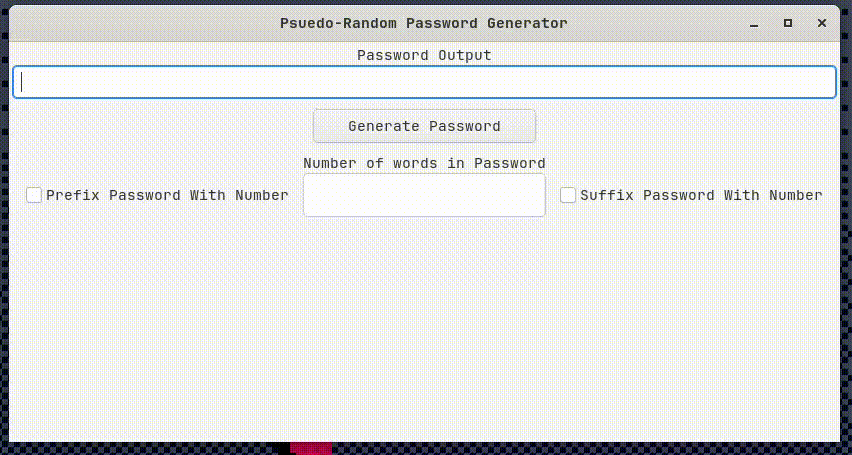

# Password Generator 
A Password Generator written in Python. 

## How it Works: 
Linux distributions come with a file that contains A LOT of english words. By selecting a random word from all the words and then doing that a few times, I can generate a pseudo-random password.

The file is located at '''/usr/share/dict/words'''. 

One "issue" is that the randomness or more importantly the security of the password is based on the randomness of the '''python import random''' Python module. There are some great conversations to be had about the security of the passwords generated by the program. 

## Why? The Inspiration: 
I read an article [here.](https://www.ncsc.gov.uk/blog-post/the-logic-behind-three-random-words) This article basically detailed the idea that 3 random words for a password is the ideal length and provides optimal security. Normally, passwords that are pre generated are very hard to remember because they look like this. 

## How it Looks:
Below is a GIF of the project.

## Links: 
Here are the links to the documentation of that I used in this project. 
- [Python Random Module](https://docs.python.org/3/library/random.html)
- [Python Type Hints](https://docs.python.org/3/library/typing.html)
- [Python GTK](https://python-gtk-3-tutorial.readthedocs.io/en/latest/index.html)

